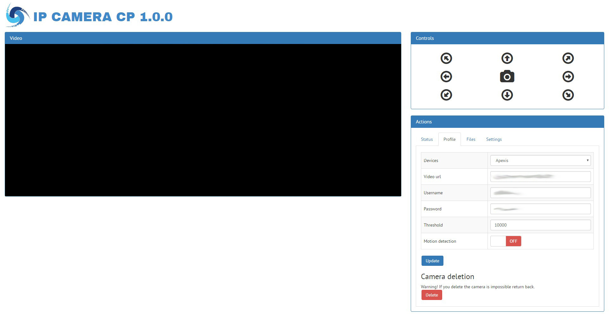

Ip Camera cp
==============

This is a open source Ip Camera control panel with FFMPEG and motion framework

| Features |
|:---|
| Full responsive (smartphone, tablet, pc) |
| Multibrowser (Chrome, firefox, internet explorer, opera, safari) |
| Work on internet and lan (server, cloud, ...) |
| Work with a lot model of ip camera |
| Remote camera control (Move and take picture) |
| Check status |
| Profile management |
| Set motion tracking (Take video) |
| Add and remove camera without write code |
| Files management |

## Images

## Instructions:
1) On linux, open terminal and write:
	
	sudo add-apt-repository ppa:mc3man/trusty-media
	
	sudo apt-get update
	
	sudo apt-get install ffmpeg

	sudo apt-get update
	
	sudo apt-get install motion
	
	sudo nano /etc/motion/motion.conf

2) Edit:

	daemon on
	
	process_id_file /var/run/motion/motion.pid

	output_normal off
	
	ffmpeg_cap_new off
	
	ffmpeg_video_codec msmpeg4
	
	text_right %Y-%m-%d\n%T | %q
	
	snapshot_filename %Y-%m-%d_%H:%M:%S_snapshot
	
	jpeg_filename %Y-%m-%d_%H:%M:%S_%q
	
	movie_filename %Y-%m-%d_%H:%M:%S
	
	timelapse_filename %Y-%m-%d_timelapse
	
	webcam_port 0
	
	control_port 32402
	
	control_localhost on # Active control panel only in local
	
	control_html_output off # Active reply html raw

3) Save, close the file and on linux, open the terminal and write:

	sudo chmod 666 /etc/motion/motion.conf
	
	sudo nano /etc/default/motion

4) Edit:

	start_motion_daemon=yes

5) Save, close the file and on linux, open the terminal and write:
	
	sudo mkdir /YOUR_PATH/motion
	
	sudo chown YOUR_USER:www-data /YOUR_PATH/motion
	
	sudo find /YOUR_PATH/motion -type d -exec chmod 775 {} \;
	
	sudo find /YOUR_PATH/motion -type f -exec chmod 664 {} \;

6) Go on your browser and write <b>"http://YOUR_IP/ipcamera_cp/web/index.php"</b>

<b>By CIMO - www.reinventsoftware.org</b>