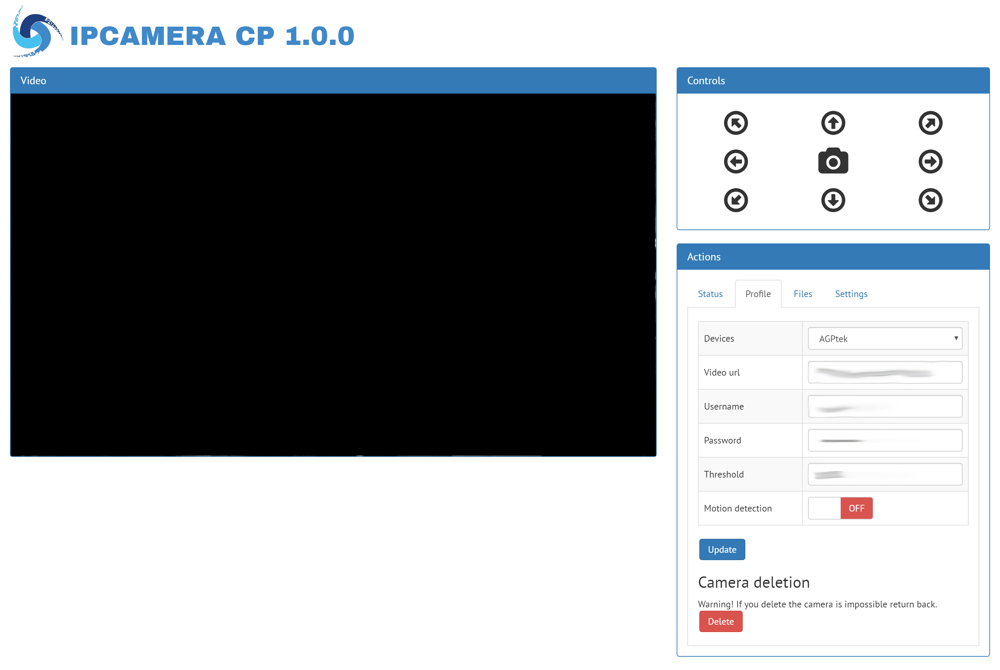
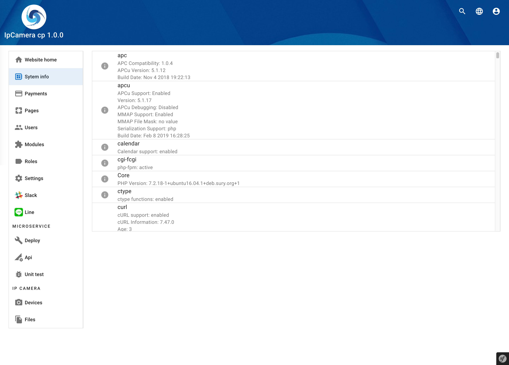

IpCamera cp
==============

Framework for management your IpCamera.

Based on "Uebusaito" project.
You can record video and take image, setting your IpCamera and use a motion detection.
WORK IN PROGRESS...

| Info: |
|:---|
| Cross browser and responsive (Chrome, Firefox, Edge, Opera, Safari) |
| Cross platform (Windows, Linux, Mac, Android, Ios) |

## Images:

| Library: |
|:---|
| Uebusaito - https://github.com/cimo/Uebusaito/ |

<b>By CIMO - https://reinventsoftware.org</b>
